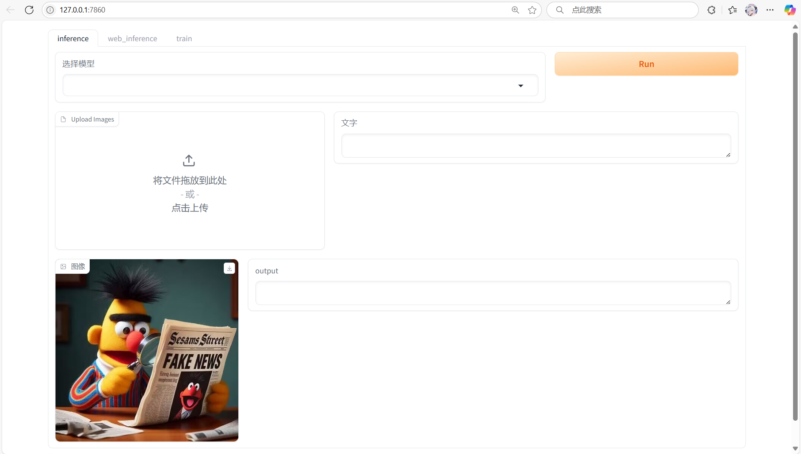

# 第二十六届中国机器人及人工智能大赛
"基于BERT预训练模型的虚假信息检测系统"项目源代码。

# Code

## Dataset

微博图文数据集

## Data Extraction

data.ipynb

## Pre-trained model

- 下载 hfl_rbt6 放在 ./model/hfl_rbt6
- 下载 resnet50 放在 ./model/img_model

## Training

使用data.ipynb处理完数据后运行：

- train.ipynb (多模态，可以处理多张图片)
- train_all.ipynb (多模态，如果有多张图片，只会取其中一张)
- train_text.ipynb (单模态，只使用文本信息)

## WebUI

运行main.py

# Poster (基于BERT预训练模型的虚假信息检测系统)
